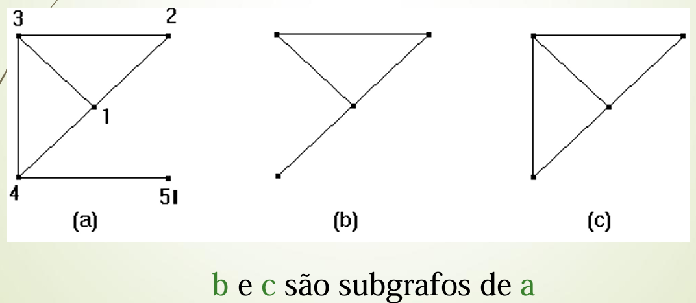
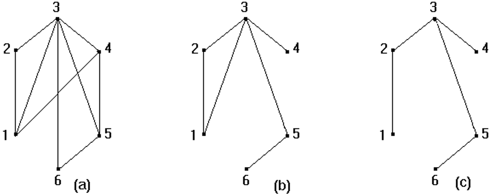

# Árvores Geradoras Mínimas

### Sub-grafo

Um sub-grafo G2(V2, E2) de um grafo G1(V1, E1) é um grafo tal que V2 está contido em V1 e E2 está contido em E1.

### Sub-grafo induzido

Um subgrafo é induzido se o sub-grafo G2 de G1 satisfaz:

Para quaisquer v, w pertencentes a V2, se a aresta (v,w) pertence a E1, então (v,w) também pertence a E2.

Ou seja, o sub-grafo que, dado um conjunto de vértices, contém todas as arestas que existiam no grafo original entre esses vértices. Na figura acima, b não é um sub-grafo induzido, porém c é.

### Sub-grafo gerador

Um sub-grafo gerador de um grafo G1(V1, E1) é um sub-grafo G2(V2, E2) de G1 tal que V1 = V2. Quando o sub-grafo gereador é uma árvore, recebe o nome de árvore geradora. Para fins de lembrança, árvores são grafos que não possuem ciclos.

b e c são sub-grafos geradoes de a. c é a árvore geradora de a e b.

### Sub-grafo gerador de custo mínimo

Formalmente:

Dado um grafo não-orientado G(V,E), com pesos associados as suas arestas, queremos encontrar um sub-grafo gerador conexo T de G tal que, para todo sub-grafo gerador conexo T' de G:

$$
\sum_{e \in T} w(e) \leq \sum_{e \in T'} w(e)
$$

Ou seja, a soma dos pesos das arestas escolhidas T deve ser menor ou igual á soma dos pesos de qualquer outro subgrafo gerador conexo possível.

Para fins de lembrança um grafo conéxo é um grafo que tem um caminho interligando quaisquer par de vértices.

## Árvore geradora mínima (MST)

É um problema que só tem solução se G for conexo, podemos ver que a solução para esse problema sempre será uma árvore, isso por que caso haja um ciclo, sempre poderemos encontrar um sub-grafo com custo menor eliminando o ciclo.

**Definição**: É a árvore geradora de um grafo valorado cuja soma dos pesos associados às arestas é mínimo, isto é, é uma árvore geradora de custo mínimo.

Para encontrar a árvore geradora mínima temos 3 algoritmos:

- Algoritmo genérico (solução gulosa)
- Algoritmo de Prim (guloso)
- Algoritmo de Kruskal

### Algoritmo de Prim

- Utilizar lista de visitados
- Adicionar o primeiro vértice a lista

- Enquanto existe vértices não visitados:
    - Considerar todas as arestas que ligam qualquer vértice visitado a um não visitado
    - Escolher a de menor valor
    - Adicionar o novo vértice a lista visitados

Complexidade:
- Matriz de Adjacência: **O(V * E)**
- Heap Binária e Lista de Adjacência: **O(V log E)**

### Algoritmo Kruskal

- Ordenar as arestas por peso crescente
- Inicializar cada vértice como um conjunto separado

- Enquanto houver arestas:
    - Escolher a próxima aresta de menor valor
    - Adicionar à árvore se não formar ciclo
    - Ignorar se formar ciclo

Complexidade com Merge Sort: **O(E log E)**